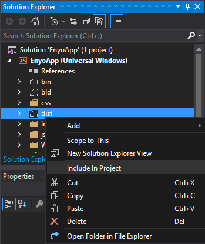

% Enyo Apps on Windows 10

In this article, we present instructions for developers wishing to deploy Enyo
applications to PCs, tablets, and phones running Windows 10, via the Windows Store.

## Before You Begin

In order to build and test your Enyo application for Windows 10, you will first
need the following:

* [Enyo 2.7 or later](../getting-started/first-steps.html)
* A PC running Windows 10 (and, optionally, a tablet or phone running Windows 10)
* Visual Studio 2015 (Community, Professional, or Enterprise edition) or
    [Visual Studio Express 2015 for Windows 10](https://www.visualstudio.com/en-us/products/visual-studio-express-vs.aspx)

## Building and Testing

### 1. Create Your Enyo Application

Build your Enyo application as described
[here](../getting-started/creating-and-building-an-app.html).

### 2. Create a New Visual Studio Project

* Open Visual Studio and select **File > New > Project**.
	The **New Project** window will open.

* Expand the left pane to **Installed > Templates > Javascript > Windows > Universal**.
	The center pane will display a list of Universal Windows Platform (UWP) apps.

	

* Select the **Blank App (Universal Windows) Javascript** template from the center pane.
	This template will create a minimal UWP app that compiles and deploys, but contains 
	no data or front-end controls.

* In the **Name** field, enter your project's name.
	For this tutorial, we'll enter the name `EnyoApp`.

* Click **OK** to create the project.
	Visual Studio will create your project and display it in the **Solution Explorer**.

	

* Copy your Enyo app's `dist` directory into your Visual Studio project structure.
	Make sure that your enyo application files are included in the project by activating
	the **Show All Files** option of the **Solution Explorer**, then right-clicking on 
	your `dist` folder, and selecting the **Include in Project** contextual menu item.

    

* Your project structure was built with your main page named `default.html`.
    Change the name of this file to `dist/index.html` to match your Enyo application.
    In the **Solution Explorer** on the right-hand side of the screen,
    double-click the `package.appxmanifest` file to open it.  You will see a
    field labeled **Start Page**.  Update this field value to match your
    `dist/index.html` starting page.

* Your project will include `css`, `js`, and `WinJS` folders by default.  Feel free to
    delete these from the project.

### 3. Build and Deploy Your Project Locally

In Visual Studio, select **Debug > Start Debugging** to build and debug your
project on your local PC.

### 4. Build and Deploy Your Project on a Remote Device (Surface or PC)

First, install Remote Tools for Visual Studio 2012 on your Microsoft Surface.

* On the remote device, open a browser instance and navigate to
    <http://www.microsoft.com/visualstudio/eng/downloads#d-additional-software>.

* Select the item **Tools for Visual Studio 2015**.
	A menu will display a list of Visual Studio Tools.

* Download and install the **Remote Tools for Visual Studio 2015 Update 1**.

Then, launch and configure the debugger that you just installed.

* On your remote device, open the Remote Debugger application.  (Note that it will
    open in the PC environment.)

* Select **Tools > Options**.

* Select **No Authentication** and ensure that **Allow any user to debug** is
    checked.  (You may need to set authentication based on your network
    situation.)

* Make sure that your computer and your Surface are on the same network. In
    Visual Studio, select **Remote Machine** as your debug/build target.

    

    Once **Remote Machine** is selected, you should be able to locate your
    Surface on the network.

### 4. Build and Deploy Your Project on a Windows 10 Mobile Device

* Connect your Windows 10 Mobile device to your computer via USB. In
    Visual Studio, select **Device** as your debug/build target.

    
